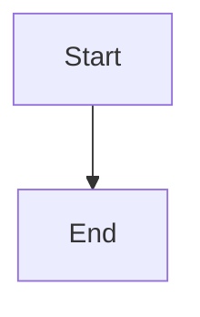

## 🐛 Bug Description

A clear and concise description of what the bug is.

## 🔄 Steps to Reproduce

1. Go to '...'
2. Click on '....'
3. Scroll down to '....'
4. See error

## ✅ Expected Behavior

A clear and concise description of what you expected to happen.

## ❌ Actual Behavior

A clear and concise description of what actually happened.

## 📸 Screenshots

If applicable, add screenshots to help explain your problem.

## 🌍 Environment

- **Browser:** [e.g. Chrome 91, Firefox 89, Safari 14]
- **OS:** [e.g. Windows 10, macOS 12.0, Ubuntu 20.04]
- **Device:** [e.g. Desktop, iPhone 12, iPad Pro]
- **Version:** [e.g. latest from main branch, v1.2.3]

## 📄 Sample Content

If the bug is related to specific markdown content, please provide a minimal example:

````markdown
# Your sample markdown here


````

```

## 🔍 Additional Context
Add any other context about the problem here.

## 🩹 Possible Solution
If you have ideas on how to fix this, please share them here.
```
