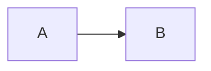

## Summary

Describe the incorrect behavior in one or two sentences.

## Reproduction

1. State the distribution: web, offline package, or Docker.
2. List the exact actions that produce the problem.
3. Include the smallest Markdown deck that reproduces it.

````markdown

```mermaid
flowchart LR
    A --> B
```
````

## Expected and actual result

Expected:

Actual:

## Environment

- Mermaid Slides version, release tag, or commit:
- Browser and version:
- Operating system:
- Viewport size, when layout is involved:

## Evidence

Attach relevant screenshots, console errors, generated PDFs, or logs. Remove private content first.

## Regression

If this worked before, state the last version where it worked.
