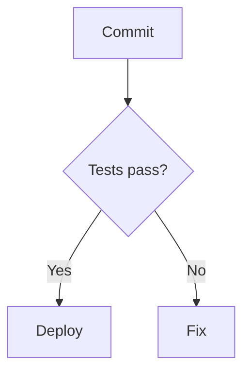

# 🧜‍♀️ Mermaid Slides

Turn a Markdown file's Mermaid diagrams and images into a presentation you can actually give. Point it
at your architecture docs and present them — no export step, no conversion, no upload.

Everything runs in your browser. Your Markdown never leaves your device.

**[▶ Try it](https://mermaid-slides.com/)** · **[🐳 Docker](https://hub.docker.com/r/kunalpathak13/mermaid-slides)** · **[💾 Offline package](https://github.com/kanad13/mermaid-slides/releases/latest)** · **[📖 Docs](docs/)** · **[🔒 Privacy](#privacy)**

Built and maintained by **[Kunal Pathak](https://www.kunal-pathak.com)**.


---

## Quick start

### Online

Open **[mermaid-slides.com](https://mermaid-slides.com/)**, drop in a Markdown file, and present.
Nothing to install.

### Docker

```bash
docker run -p 3000:3000 kunalpathak13/mermaid-slides:latest
```

Then open http://localhost:3000.

The image holds static files and a small Python server. Nothing writes to disk and nothing calls out,
so you can lock it down further:

```bash
docker run -p 3000:3000 --read-only --cap-drop=ALL kunalpathak13/mermaid-slides:latest
```

Multi-platform (amd64, arm64), runs as an unprivileged user, built from a digest-pinned base.

### Offline package

Download the archive from the [latest release](https://github.com/kanad13/mermaid-slides/releases/latest),
extract it, and start whichever server suits the machine:

```bash
python3 start-server.py     # Python
node start-server.js        # Node.js
./start-server.sh           # macOS/Linux, auto-detects
start-server.bat            # Windows, auto-detects
```

Then open http://localhost:3000. No internet connection needed, at any point.

### From source

Requires **Node 22.12+**.

```bash
git clone https://github.com/kanad13/mermaid-slides.git
cd mermaid-slides
npm install
npm run dev
```

---

## How it works

Write ordinary Markdown. Every ```` ```mermaid ```` block and every `` becomes a slide, in
document order. The nearest preceding heading becomes that slide's title.

````markdown
## Deployment flow


````

That is the entire format. There are no slide delimiters to learn and no front matter — a document
written for reading is already a deck.

**Presenting**: arrow keys to navigate, `Home` and `End` to jump to either end, `Esc` to return to the
editor. A grid view shows every slide at once; click one to jump to it. Titles and header auto-hide
can be toggled while presenting.

**Exporting to PDF**: the printer button lays the whole deck out one slide per page in landscape and
opens your browser's print dialog — choose "Save as PDF" as the destination. The output is vector, so
diagrams stay sharp at any zoom and the text remains selectable. It works offline and in the Docker
image, because it is your browser doing the work; nothing is uploaded and no conversion service is
involved.

**Supported diagrams**: flowcharts, sequence, ER, class, state, Gantt, pie, git graphs — whatever
Mermaid 11 renders. **Images**: PNG, JPEG, GIF, WebP, scaled to fit.

---

## Privacy

This is the part the project actually cares about, so it is worth being precise rather than
reassuring.

**What the app stores: nothing.** No cookies, no local storage, no session storage, no service
worker. No analytics, no telemetry, no error reporting. Settings reset when you reload, by design —
losing your preferences is the feature.

**What the app sends: nothing.** Your Markdown is parsed and rendered entirely in your browser. There
is no server to send it to; the hosted version is static files.

**The one exception, and it is your choice.** If your Markdown references an image by URL —
`` — your browser fetches it, and that request tells the
hosting server your IP address and browser details. That is how images work on the web. Mermaid
Slides permits it deliberately, because you put that image there on purpose and silently refusing to
load it would break real documents.

If you want a deck that provably reaches nobody, use local image paths or diagrams only — or run the
offline package or Docker image, which involve no third party at all.

**Hosting.** The web version is served from GitHub Pages and may pass through Cloudflare. Both may
log technical data such as your IP, and Cloudflare may set strictly necessary cookies. Those are
theirs, not ours. The offline and Docker channels avoid them entirely.

**Enforcement, not just intent.** A Content-Security-Policy ships with every channel. Scripts load
only from the app's own files and inline script is refused outright, so a Markdown file cannot run
code in the page even if it is crafted to try. The offline servers bind locally and refuse request
paths that escape their directory.

---

## Documentation

- **[Work Plan](docs/WORKPLAN.md)** — what is in progress, what was decided, what was declined
- **[Testing Guide](docs/TESTING.md)** — gates, channel matrix, manual smoke checklist
- **[Deployment Guide](docs/DEPLOYMENT.md)** — release flow and channel specifics
- **[Contributing Guide](docs/CONTRIBUTING.md)** — development workflow
- **[Agent Context](AGENTS.md)** — architecture notes and the traps worth knowing

---

## Also available in VS Code

Two companion extensions, published from separate repositories:

- **[Mermaid Slideshow](https://marketplace.visualstudio.com/items?itemName=KunalPathak.mermaid-slideshow)** — Mermaid-only files, one diagram per slide
- **[Markdown Presentation Tool](https://marketplace.visualstudio.com/items?itemName=KunalPathak.markdown-presentation-tool)** — full Markdown decks with `<!-- slide -->` delimiters

---

## Built with

React 19 · TypeScript · Vite 7 · Tailwind CSS 3.4 · Mermaid.js 11 · Vitest

Mermaid Slides is an independent, community project and **not an official product** of the Mermaid.js
team. It uses their library under the MIT Licence, and exists because of their work.

Grateful to [Mermaid.js](https://github.com/mermaid-js/mermaid) (Knut Sveidqvist),
[React](https://github.com/facebook/react) (Meta), [Vite](https://github.com/vitejs/vite) (Evan You),
[Tailwind CSS](https://github.com/tailwindlabs/tailwindcss), and
[TypeScript](https://github.com/microsoft/TypeScript). Full dependency list in
[package.json](package.json).

---

## Contributing

Issues and pull requests are welcome — see the [Contributing Guide](docs/CONTRIBUTING.md). One thing
to know up front: merging to `master` publishes to all three channels immediately, so the testing
matrix runs before a merge rather than after.

## Licence

MIT — see [LICENSE](LICENSE).
