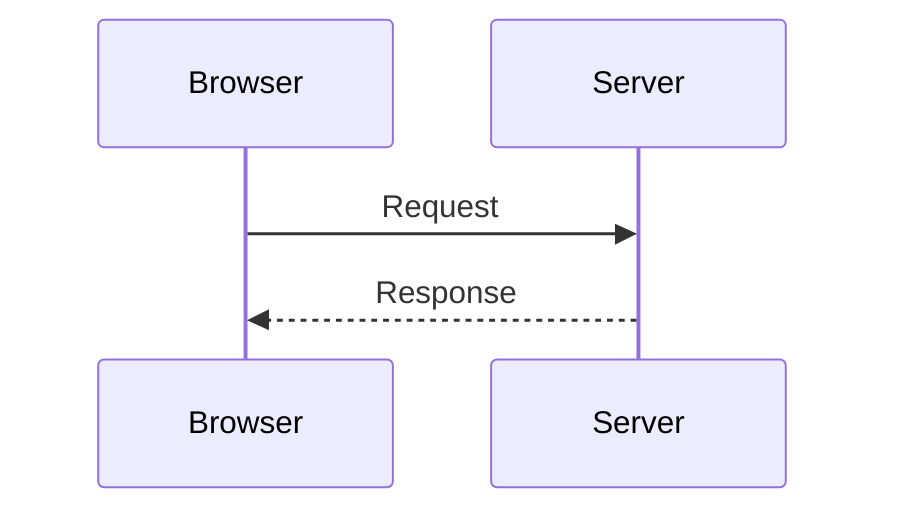

# Mermaid Slides

Mermaid Slides turns Mermaid diagrams and Markdown images into a browser-based slide deck. Load a
Markdown file, paste Markdown, or open the sample; the app extracts slides and presents them with
keyboard navigation, a grid view, titles, and viewer settings.

[Live app](https://mermaid-slides.com/) ·
[Offline releases](https://github.com/kanad13/mermaid-slides/releases/latest) ·
[Docker image](https://hub.docker.com/r/kunalpathak13/mermaid-slides) ·
[Report an issue](https://github.com/kanad13/mermaid-slides/issues)


## Use Mermaid Slides

### Web

Open [mermaid-slides.com](https://mermaid-slides.com/).

### Offline package

Download the latest offline zip from
[GitHub Releases](https://github.com/kanad13/mermaid-slides/releases/latest), extract it, and run one
of the bundled launchers:

```bash
./start-server.sh
python3 start-server.py
node start-server.js
```

Windows users can run `start-server.bat`. The extracted package contains its own README with runtime
and security details.

### Docker

```bash
docker run -p 3000:3000 kunalpathak13/mermaid-slides:latest
```

Then open `http://localhost:3000`.

## Markdown format

A Mermaid fenced block becomes a diagram slide. A Markdown image becomes an image slide. The nearest
preceding heading becomes the slide title.

````markdown
# Request flow



## Architecture image


````

The renderer supports diagram types provided by the bundled Mermaid version. The viewer is designed
for desktop use; narrow mobile controls are not currently a supported layout.

## Privacy and network behavior

- Mermaid Slides has no account, analytics, telemetry, or application backend.
- Markdown and Mermaid source are processed in the browser and are not uploaded by the app.
- The app does not persist content or settings in browser storage or cookies.
- The hosting provider receives ordinary web requests when the web app is opened.
- Image URLs in Markdown are loaded by the browser. A remote image therefore sends an ordinary image
  request to that image host.
- Web, offline, and Docker builds bundle application code locally; user-authored remote images still
  require their remote hosts.

## Local development

See [Contributing and code standards](docs/CONTRIBUTING.md) for setup, architecture, and development
rules.

## Documentation

- [Contributing and code standards](docs/CONTRIBUTING.md)
- [Testing strategy](docs/TESTING.md)
- [Build and deployment](docs/DEPLOYMENT.md)
- [Development roadmap](docs/WORKPLAN.md)
- [Agent operating guide](AGENTS.md)

## Related VS Code extensions

- [Mermaid Slideshow](https://marketplace.visualstudio.com/items?itemName=KunalPathak.mermaid-slideshow)
- [Markdown Presentation Tool](https://marketplace.visualstudio.com/items?itemName=KunalPathak.markdown-presentation-tool)

These extensions are maintained in separate repositories.

## Project and license

Mermaid Slides is an independent community project built with
[Mermaid](https://github.com/mermaid-js/mermaid), React, TypeScript, Vite, and Tailwind CSS. It is not
an official Mermaid project.

Maintainer: [Kunal Pathak](https://www.kunal-pathak.com)

Licensed under the [MIT License](LICENSE).
