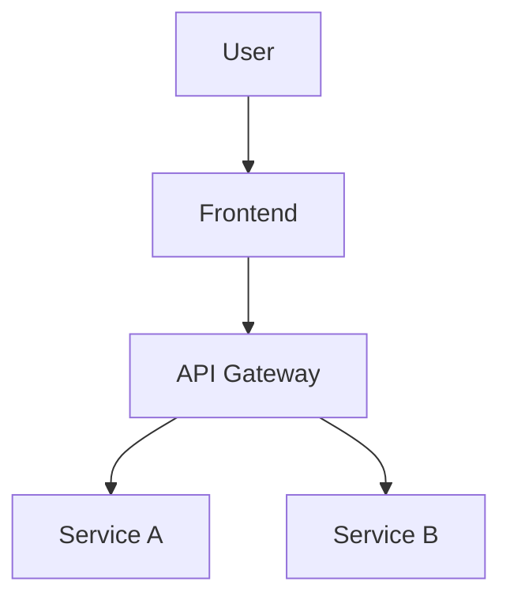
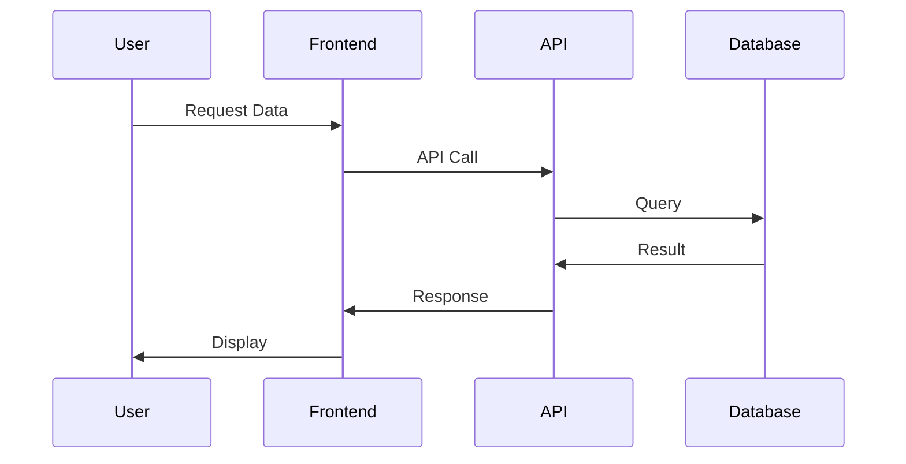
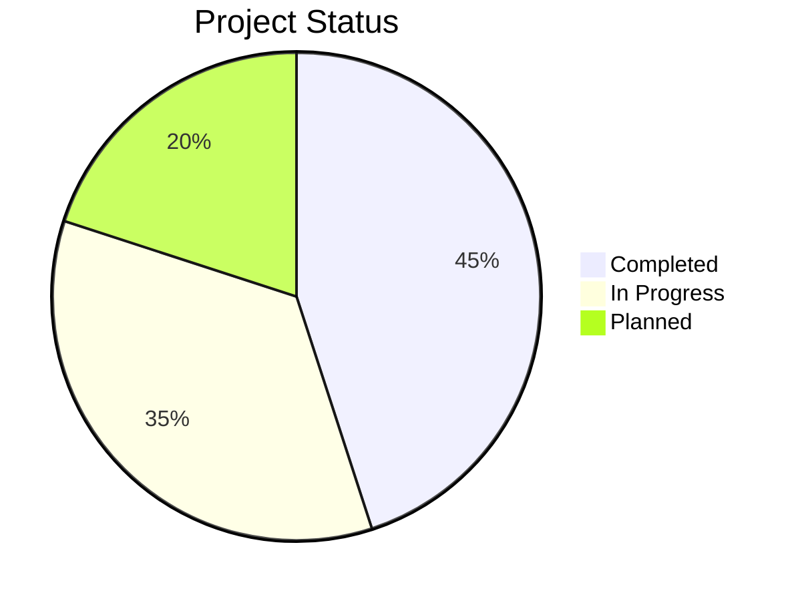
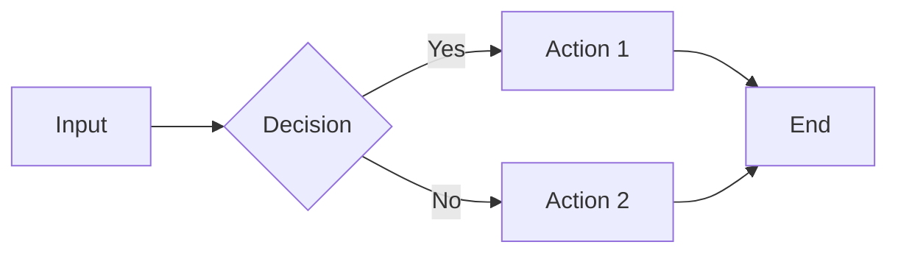
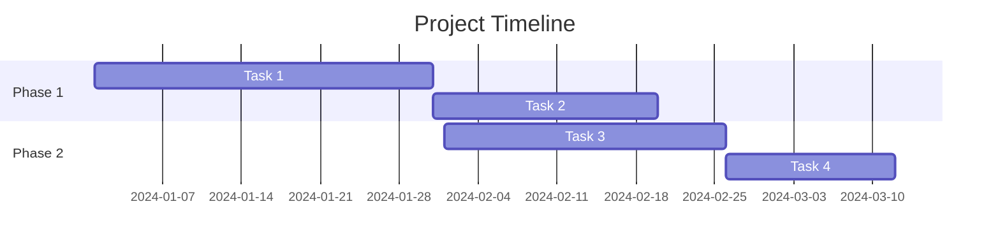
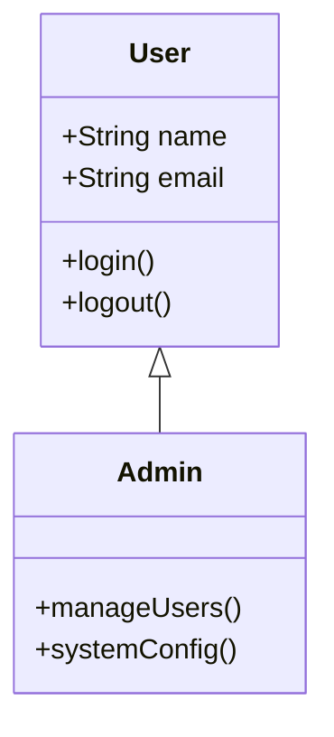

# VS Code Extension Testing Guide

This guide provides step-by-step instructions for testing the Mermaid Slides VS Code extension.

## 🔧 Prerequisites

1. **VS Code or VS Code Insiders** installed
2. **Node.js** >= 14.0.0
3. **Extension built** (`npm run build:extension-app && npm run extension:compile`)

## 📦 Installation Methods

### Method 1: Install via VS Code UI (Recommended)

1. Open VS Code or VS Code Insiders
2. Press `Ctrl+Shift+P` (Windows/Linux) or `Cmd+Shift+P` (macOS)
3. Type: `Extensions: Install from VSIX...`
4. Select the option and navigate to: `extension/mermaid-slides-extension-1.0.0.vsix`
5. Click "Install"
6. Reload VS Code when prompted

### Method 2: Install via Command Line (if `code` command is available)

**Check if `code` command is available:**
```bash
# Test if code command exists
code --version
```

If the command is not found, you need to add it to your PATH:

**For VS Code:**
1. Open VS Code
2. Press `Ctrl+Shift+P` / `Cmd+Shift+P`
3. Type: `Shell Command: Install 'code' command in PATH`
4. Select it and restart your terminal

**For VS Code Insiders:**
1. Open VS Code Insiders  
2. Press `Ctrl+Shift+P` / `Cmd+Shift+P`
3. Type: `Shell Command: Install 'code-insiders' command in PATH`
4. Select it and restart your terminal

**Then install via command line:**
```bash
# For VS Code
code --install-extension extension/mermaid-slides-extension-1.0.0.vsix

# For VS Code Insiders  
code-insiders --install-extension extension/mermaid-slides-extension-1.0.0.vsix
```

### Method 3: Manual Installation

1. Copy `extension/mermaid-slides-extension-1.0.0.vsix` to your VS Code extensions folder:
   - **Windows**: `%USERPROFILE%\.vscode\extensions\`
   - **macOS**: `~/.vscode/extensions/`
   - **Linux**: `~/.vscode/extensions/`
2. Extract the VSIX file (it's a ZIP archive)
3. Restart VS Code

## 🧪 Testing the Extension

### Step 1: Create Test Markdown File

Create a new file called `test-mermaid.md` with this content:

```markdown
# Test Mermaid Slides

## Slide 1: System Overview


## Slide 2: Sequence Diagram


## Slide 3: Pie Chart


## Slide 4: Flowchart


## Slide 5: Gantt Chart


## Slide 6: Class Diagram

```

### Step 2: Test Extension Activation

1. Open the `test-mermaid.md` file in VS Code
2. Look for the "🧜‍♀️ Preview Mermaid Slides" button in the editor toolbar (top-right)
3. If you don't see it, check that the file is saved with `.md` extension

### Step 3: Test Preview Functionality

1. Click the "🧜‍♀️ Preview Mermaid Slides" button
2. **Alternative**: Press `Ctrl+Shift+P` / `Cmd+Shift+P` and type "Preview Mermaid Slides"
3. The extension should open a webview panel showing your slides

### Step 4: Test Navigation

1. Use the navigation buttons to move between slides
2. Test keyboard shortcuts:
   - `←` / `→` for previous/next slide
   - `Home` / `End` for first/last slide
   - `Escape` to focus back to editor

### Step 5: Test Grid View and Scrolling ✨

**This is the key test for the Phase 1 fix:**

1. In the slides view, click the grid icon (⊞) in the top-right
2. You should see all 6 diagrams in a grid layout
3. **Expected behavior**: 
   - Grid should be scrollable if it exceeds the webview height
   - You should be able to scroll through all diagrams
   - Clicking on any diagram should switch to single-view mode

### Step 6: Test Theme Selection ✨

**This tests the Phase 1 theme dropdown fix:**

1. In slides view, click the palette icon (🎨) in the top-right
2. Try selecting different themes:
   - **Default** → Should apply default theme
   - **Dark** → Should apply dark theme (not forest!)
   - **Forest** → Should apply forest theme
   - **Base** → Should apply base theme
   - **Neutral** → Should apply neutral theme
3. **Expected behavior**: The selected theme name should match the visual appearance

## 🔍 Troubleshooting

### Extension Doesn't Load
- Check VS Code version: Must be >= 1.60.0
- Reload VS Code: `Ctrl+Shift+P` → "Developer: Reload Window"
- Check for conflicts: Disable other markdown/mermaid extensions temporarily

### No Preview Button
- Ensure file has `.md` extension
- Check that file contains mermaid code blocks
- Try saving the file first

### Grid View Not Scrolling
- Ensure you have enough diagrams (6+ recommended)
- Try zooming VS Code to 100% (`Ctrl+0` / `Cmd+0`)
- Check VS Code developer console: `Help` → `Toggle Developer Tools`

### Theme Selection Issues
- Hard refresh: Close and reopen the webview panel
- Check browser cache if using VS Code in browser

## 🗑️ Uninstalling the Extension

### Via VS Code UI
1. Press `Ctrl+Shift+P` / `Cmd+Shift+P`
2. Type: `Extensions: Show Installed Extensions`
3. Find "🧜‍♀️ Mermaid Slides"
4. Click the gear icon → "Uninstall"

### Via Command Line
```bash
# For VS Code
code --uninstall-extension mermaid-slides.mermaid-slides-extension

# For VS Code Insiders
code-insiders --uninstall-extension mermaid-slides.mermaid-slides-extension
```

## 📝 Testing Checklist

After installation, verify these work:

- [ ] Extension appears in Extensions panel
- [ ] Preview button shows in markdown editor toolbar
- [ ] Command palette includes "Preview Mermaid Slides"
- [ ] Webview opens when clicking preview button
- [ ] All 6 test diagrams render correctly
- [ ] Navigation between slides works
- [ ] Grid view shows all diagrams
- [ ] Grid view is scrollable ✨ **(Phase 1 fix)**
- [ ] Theme dropdown shows correct themes ✨ **(Phase 1 fix)**
- [ ] Selecting themes applies correct visual appearance ✨ **(Phase 1 fix)**
- [ ] Extension can be uninstalled cleanly

## 🚀 Next Steps

Once testing is complete:

1. **Package for distribution**: `npm run extension:package`
2. **Publish to marketplace**: `cd extension && npx vsce publish`
3. **Document in main README**: Update installation instructions

## 📊 Phase 1 Verification

The Phase 1 fixes can be verified by:

1. **Theme Dropdown**: Selecting "Dark" applies dark theme (not forest)
2. **Grid Scrolling**: Grid view with 6+ diagrams is scrollable in VS Code  
3. **Auto-Hide**: Header hides after 3 seconds of inactivity (web version)

If any of these don't work, please report the specific behavior observed.