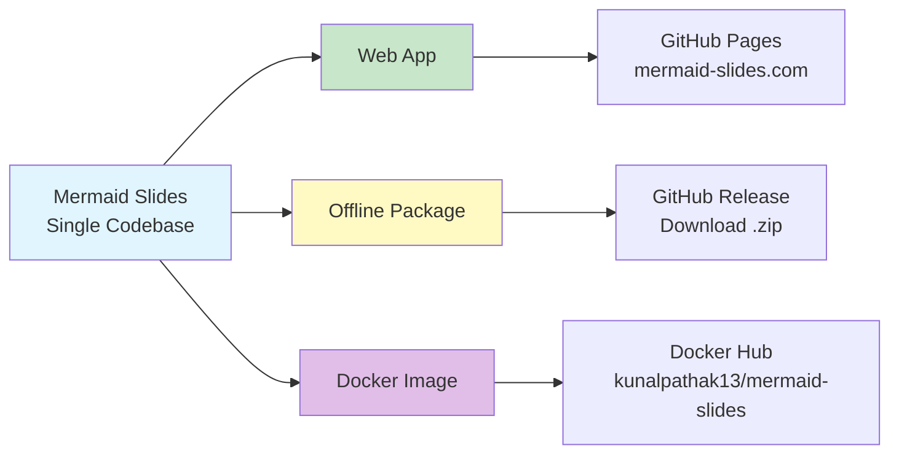
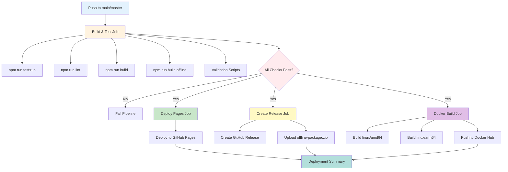
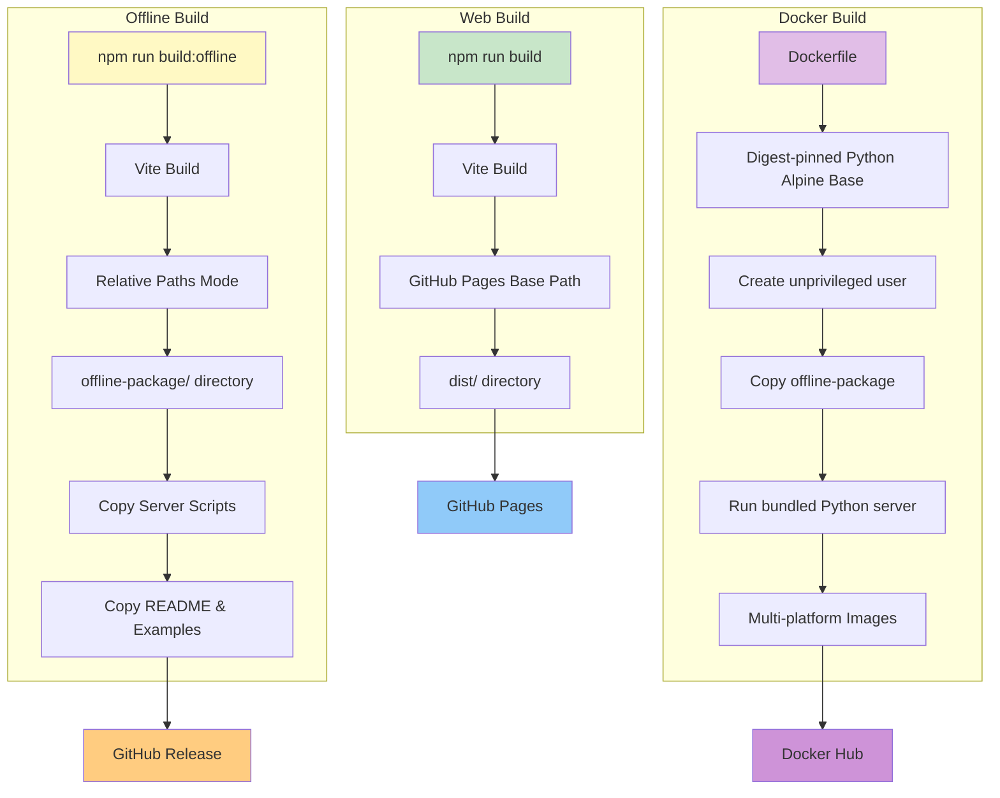

# Deployment Guide

Mermaid Slides deploys through three automated channels: Web App, Offline Package, and Docker Container.

---

## Distribution Channels



### 🌐 Web Application

**Live at**: https://mermaid-slides.com/

**Features:**

- Zero installation required
- Mobile responsive
- Always up-to-date
- CDN-optimized performance

**Deployment:**

- Automated via GitHub Actions to GitHub Pages
- Triggers on push to `main` branch
- Build time: ~2-3 minutes

**Best for**: Quick testing, mobile use, instant access, URL sharing

### 💾 Offline Package

**Download**: [Latest Release](https://github.com/kanad13/mermaid-slides/releases/latest)

**Features:**

- Complete offline functionality
- Cross-platform server scripts (Python, Node.js, Shell, Batch)
- Zero external dependencies
- Air-gapped environment support

**Requirements**: Python 3.7+ OR Node.js 14+

**Best for**: Corporate networks, restricted environments, privacy-focused use

### 🐳 Docker Container

**Image**: `kunalpathak13/mermaid-slides:latest`

**Features:**

- Multi-platform support (linux/amd64, linux/arm64)
- Isolated environment
- Consistent deployment
- Ships the generated offline package behind a lightweight container wrapper

**Quick Start:**

```bash
docker run -p 3000:3000 kunalpathak13/mermaid-slides:latest
```

**Best for**: DevOps teams, containerized environments, cloud deployments

---

## Architecture Strategy

### Single Repository Approach

**Repository**: `mermaid-slides/` (unified codebase)

**Structure:**

```
mermaid-slides/
├── src/              # Core React application (shared across all channels)
├── public/           # Web assets
├── scripts/          # Build and deployment automation
├── docs/             # Documentation
├── config/           # Build configurations
├── dist/             # Web build output (git-ignored)
└── offline-package/  # Offline build output (git-ignored)
```

**Benefits:**

- Single source of truth for bug fixes and features
- Shared component library, hooks, utilities
- Unified testing suite
- Simplified dependency management

### Channel-Specific Builds

**Web Channel:**

- Build: `npm run build`
- Config: `vite.config.js` with GitHub Pages base path
- Output: `dist/`

**Offline Channel:**

- Build: `npm run build:offline`
- Config: Modified Vite config for relative paths
- Output: `offline-package/` with bundled servers
- Servers: Python, Node.js, shell, batch scripts

**Docker Channel:**

- Build: Automated via GitHub Actions
- Base: Python 3.11 Alpine with Node.js installed for compatibility testing
- Runtime: Serves the generated offline package via the bundled local server script

---

## Automated Deployment Pipeline

### GitHub Actions Workflow

**File**: `.github/workflows/deploy.yml`



**Jobs:**

1. **Build & Test** - Tests, linting, builds, validation
2. **Deploy Pages** - GitHub Pages deployment
3. **Create Release** - GitHub releases with offline package
4. **Docker Build** - Multi-platform Docker images
5. **Deployment Summary** - Consolidated status report

**Triggers:**

- Push to `main` or `master` branch
- Manual workflow dispatch

### Version Synchronization

**Format**: Semantic Versioning (MAJOR.MINOR.PATCH)

- **Source**: `package.json` version field (single source of truth)
- **Strategy**: All channels use same core version
- **Git Tags**: `v1.2.3` format
- **Release Coordination**: All channels built from same commit

**Version Display:**

- Web: Application footer
- Offline: Server startup message
- Docker: Image tags and container labels

---

## Build Commands

### Build Process Flow



### Command Reference

**Maintainer build requirement:** Node **20.19+** or **22.12+** for repository builds and CI.

```bash
# Development
npm run dev                    # Local dev server

# Production Builds
npm run build                  # Web production build
npm run build:offline          # Offline package with servers

# Validation
npm test                       # Test suite (watch mode)
npm run test:run               # Test suite (single run for CI/validation)
npm run lint                   # Code quality
npm run validate:all           # Full cross-platform validation
npm run validate:compatibility # Offline package validation
npm run validate:continuity    # Documentation consistency
```

---

## Cross-Platform Compatibility

### Testing Matrix

| Platform    | Web                   | Offline              | Status   |
| ----------- | --------------------- | -------------------- | -------- |
| **Windows** | Chrome/Edge/Firefox   | Python/Node.js/Batch | ✅ Ready |
| **macOS**   | Safari/Chrome/Firefox | Python/Node.js/Shell | ✅ Ready |
| **Linux**   | Chrome/Firefox        | Python/Node.js/Shell | ✅ Ready |

### Requirements

**Web Channel:**

- Browsers: Chrome 90+, Firefox 88+, Safari 14+, Edge 90+
- Mobile: iOS Safari 14+, Android Chrome 90+
- Features: ES2020, CSS Grid, WebGL

**Repository Build / CI:**

- Node.js: 20.19+ or 22.12+
- Commands: `npm run test:run`, `npm run build`, `npm run build:offline`

**Offline Channel:**

- Runtimes: Python 3.7+ OR Node.js 14+
- Systems: Windows 10+, macOS 10.15+, Ubuntu 18.04+
- Network: Zero external requirements

**Docker Channel:**

- Runtime: Docker 20.10+
- Platforms: linux/amd64, linux/arm64

---

## Quality Assurance Checklist

### Pre-Deployment Validation

**All Channels:**

- [ ] All tests passing: `npm run test:run`
- [ ] Build successful: `npm run build && npm run build:offline`
- [ ] Linting clean: `npm run lint`
- [ ] Cross-platform compatibility verified: `npm run validate:all`

**Web Channel:**

- [ ] GitHub Pages deployment functional
- [ ] Mobile responsiveness verified
- [ ] Performance metrics acceptable

**Offline Channel:**

- [ ] Package integrity validated: `npm run validate:compatibility`
- [ ] All server scripts functional (Python, Node.js, Shell, Batch)
- [ ] Docker image builds and runs
- [ ] Zero external URL dependencies
- [ ] Cross-platform testing complete

**Docker Channel:**

- [ ] Multi-platform build successful
- [ ] Container starts and serves correctly
- [ ] Port 3000 accessible

---

## Release Process

### Workflow

1. **Update Version**: Bump `package.json` version
2. **Build All Channels**: `npm run build && npm run build:offline`
3. **Run Validation**: `npm run validate:all`
4. **Commit & Tag**: Create git tag (e.g., `v1.2.3`)
5. **Push to Main**: Automated deployment triggers
6. **Verify Deployment**: Check all three channels

### Automated Steps (via GitHub Actions)

- Web app deploys to GitHub Pages
- Offline package creates GitHub Release
- Docker image builds and pushes to Docker Hub
- Deployment summary provides status

---

## Security & Privacy

**All Channels:**

- ✅ Zero data collection or tracking
- ✅ Client-side processing only
- ✅ No external API calls

**Web Channel:**

- HTTPS encryption via GitHub Pages
- Self-contained assets

**Offline Channel:**

- Complete network isolation capability
- Air-gapped environment support

**Docker Channel:**

- Isolated container environment
- Minimal attack surface

---

## Troubleshooting

### Web Application

- **Slow loading**: Check network connection
- **Features not working**: Verify JavaScript enabled
- **Mobile issues**: Use modern browser

### Offline Package

- **Server won't start**: Check Python/Node.js installation
- **Port conflicts**: Use custom port with `-p` flag
- **Script errors**: Use appropriate script for your OS

### Docker Container

- **Image won't pull**: Check Docker Hub connectivity
- **Container won't start**: Verify port 3000 available
- **Performance issues**: Check Docker resource allocation

---

## Support

**Documentation**: Complete guides for each channel
**Issues**: [GitHub Issues](https://github.com/kanad13/mermaid-slides/issues)
**Community**: GitHub Discussions

**Status**: All three channels are production-ready with automated synchronized releases.
