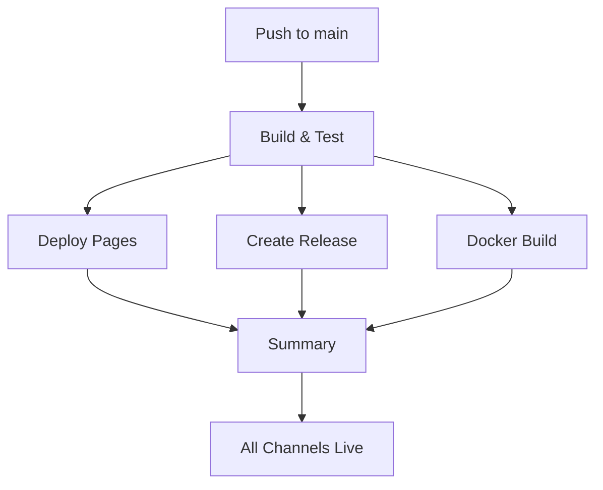

# 🚀 GitHub Actions CI/CD Setup

This document explains the automated deployment pipeline for Mermaid Slides.

## 📋 Overview

The repository uses a comprehensive GitHub Actions workflow that automatically deploys to all three distribution channels on every commit to the main branch:

1. **🌐 Web Application** → GitHub Pages
2. **📦 Offline Package** → GitHub Releases  
3. **🐳 Docker Image** → Docker Hub

## 🔧 Workflow Configuration

### File Location
`.github/workflows/deploy.yml`

### Trigger Events
- **Push to main/master branch**: Full deployment pipeline
- **Manual dispatch**: Can be triggered manually from GitHub Actions tab

### Required Secrets

Since you mentioned Docker secrets are already configured, the workflow expects these GitHub repository secrets:

| Secret | Description | Required For |
|--------|-------------|--------------|
| `DOCKER_USERNAME` | Docker Hub username | Docker image push |
| `DOCKER_PASSWORD` | Docker Hub access token | Docker image push |
| `GITHUB_TOKEN` | Auto-generated by GitHub | GitHub release creation |

### Required Permissions

The workflow has these permissions configured:
- `contents: write` - For creating releases
- `pages: write` - For GitHub Pages deployment  
- `id-token: write` - For GitHub Pages authentication

## 🏗️ Pipeline Jobs

### 1. 🔨 Build & Test
- **Purpose**: Validate code quality and build artifacts
- **Steps**:
  - Checkout code
  - Setup Node.js 20 with npm cache
  - Install dependencies
  - Run tests (`npm test`)
  - Run linting (`npm run lint`)
  - Build web application (`npm run build`)
  - Validate cross-platform compatibility
  - Extract version from package.json
  - Upload build artifacts for other jobs

### 2. 🌐 Deploy to GitHub Pages
- **Purpose**: Deploy web application to GitHub Pages
- **Dependencies**: Build & Test job
- **Steps**:
  - Download build artifacts
  - Configure GitHub Pages
  - Upload dist/ folder to Pages
  - Deploy to GitHub Pages
- **Result**: Live web app at https://kanad13.github.io/mermaid-slides/

### 3. 📦 Create GitHub Release
- **Purpose**: Package and release offline version
- **Dependencies**: Build & Test job
- **Steps**:
  - Download build artifacts
  - Create versioned ZIP archive from offline-package/
  - Generate SHA256 checksum
  - Create comprehensive release notes
  - Create GitHub release with assets
- **Result**: Downloadable offline package in GitHub Releases

### 4. 🐳 Build & Push Docker Image
- **Purpose**: Build and publish Docker image
- **Dependencies**: Build & Test job
- **Steps**:
  - Download build artifacts
  - Setup Docker Buildx
  - Login to Docker Hub
  - Build multi-platform image (linux/amd64, linux/arm64)
  - Push with version and latest tags
- **Result**: Docker image available at `kunalpathak13/mermaid-slides`

### 5. 📊 Deployment Summary
- **Purpose**: Provide comprehensive deployment status
- **Dependencies**: All previous jobs
- **Output**: GitHub Actions summary with:
  - Status table for all channels
  - Quick access links
  - Usage instructions

## 🎯 Deployment Flow



## 🔄 Automatic Version Management

The workflow automatically:
- Extracts version from `package.json`
- Creates git tags (`v1.0.0`)
- Names releases consistently
- Tags Docker images with version and `latest`

## 📦 Release Assets

Each GitHub release includes:
- **Offline Package**: `mermaid-slides-offline-v{version}.zip`
- **Checksum**: `mermaid-slides-offline-v{version}.zip.sha256`
- **Release Notes**: Comprehensive documentation with usage instructions

## 🔗 Access Points After Deployment

### Web Application
- **URL**: https://kanad13.github.io/mermaid-slides/
- **Update**: Automatic on every commit to main

### Offline Package
- **URL**: https://github.com/kanad13/mermaid-slides/releases/latest
- **Content**: Self-contained package with Python/Node.js servers

### Docker Image
```bash
# Latest version
docker pull kunalpathak13/mermaid-slides:latest
docker run -p 3000:3000 kunalpathak13/mermaid-slides:latest

# Specific version
docker pull kunalpathak13/mermaid-slides:1.0.0
docker run -p 3000:3000 kunalpathak13/mermaid-slides:1.0.0
```

## 🛠️ Manual Triggers

You can manually trigger the deployment:

1. Go to **Actions** tab in GitHub repository
2. Select **"🚀 Deploy Mermaid Slides"** workflow
3. Click **"Run workflow"**
4. Choose branch (typically main/master)
5. Click **"Run workflow"**

## ⚡ Performance Features

- **Parallel Jobs**: All deployment jobs run in parallel after build
- **Artifact Sharing**: Build artifacts shared between jobs
- **Docker Caching**: GitHub Actions cache for faster Docker builds
- **Multi-platform**: Docker images built for AMD64 and ARM64

## 🔍 Monitoring & Debugging

### Workflow Status
- Check the **Actions** tab for workflow runs
- Each job shows detailed logs
- Failed jobs will block subsequent releases

### Common Issues
1. **Docker Login Fails**: Verify `DOCKER_USERNAME` and `DOCKER_PASSWORD` secrets
2. **Pages Deployment Fails**: Check repository settings → Pages → Source = "GitHub Actions"
3. **Release Creation Fails**: Verify repository has "Write" permissions for Actions

## 🔄 Next Steps

After this workflow is committed and pushed:

1. **First Run**: The workflow will trigger and create your first automated release
2. **Monitor**: Check the Actions tab to ensure all jobs complete successfully  
3. **Verify**: Check that all three distribution channels are updated
4. **Documentation**: Update any links in README to point to the new release structure

---

**🎉 Result**: Every commit to main now automatically deploys to all three channels with complete testing and validation!