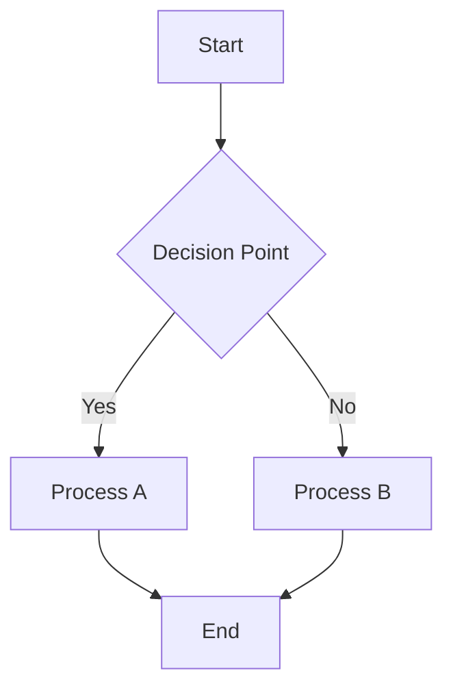
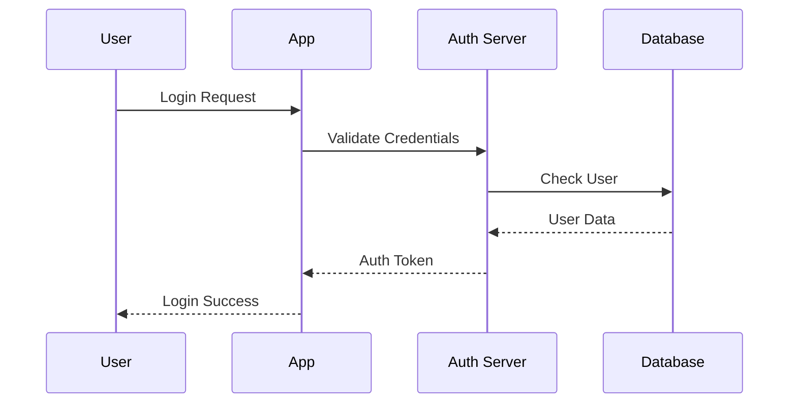
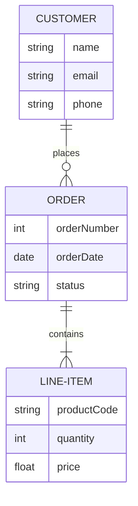
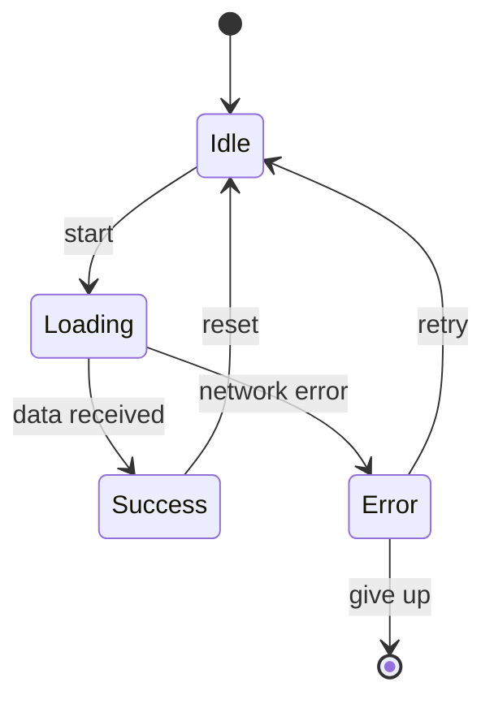

# Sample Markdown Document 1

This is a sample markdown document demonstrating various Mermaid diagram types for use with Mermaid Slides.

## Simple Flowchart

## User Authentication Flow

## Basic Entity Relationship

## State Machine Example

This document contains **4 mermaid diagrams** that will be extracted and displayed as slides.
