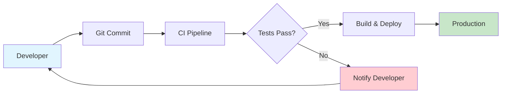
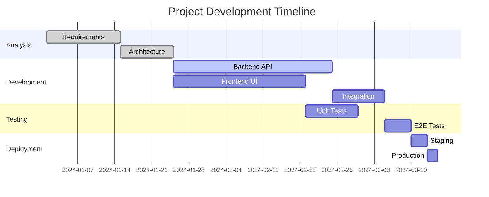
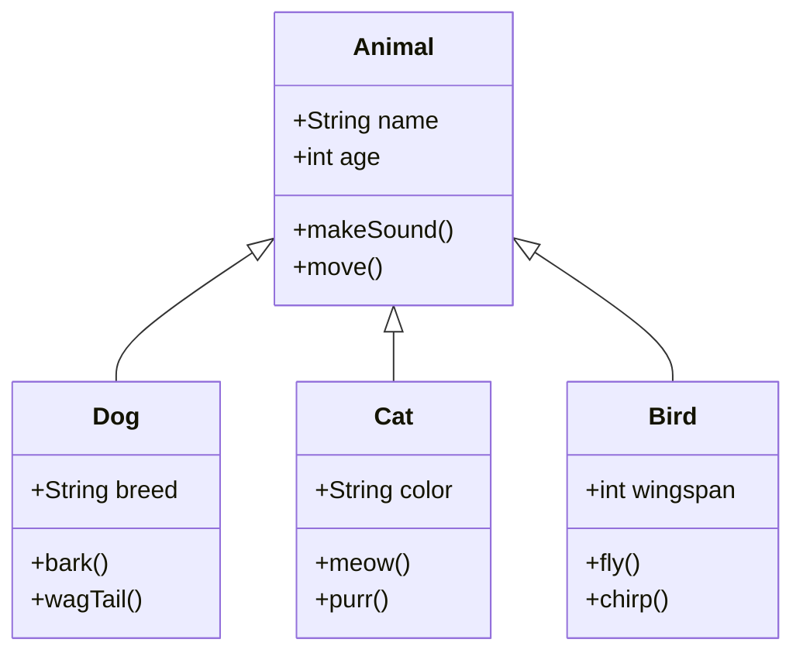
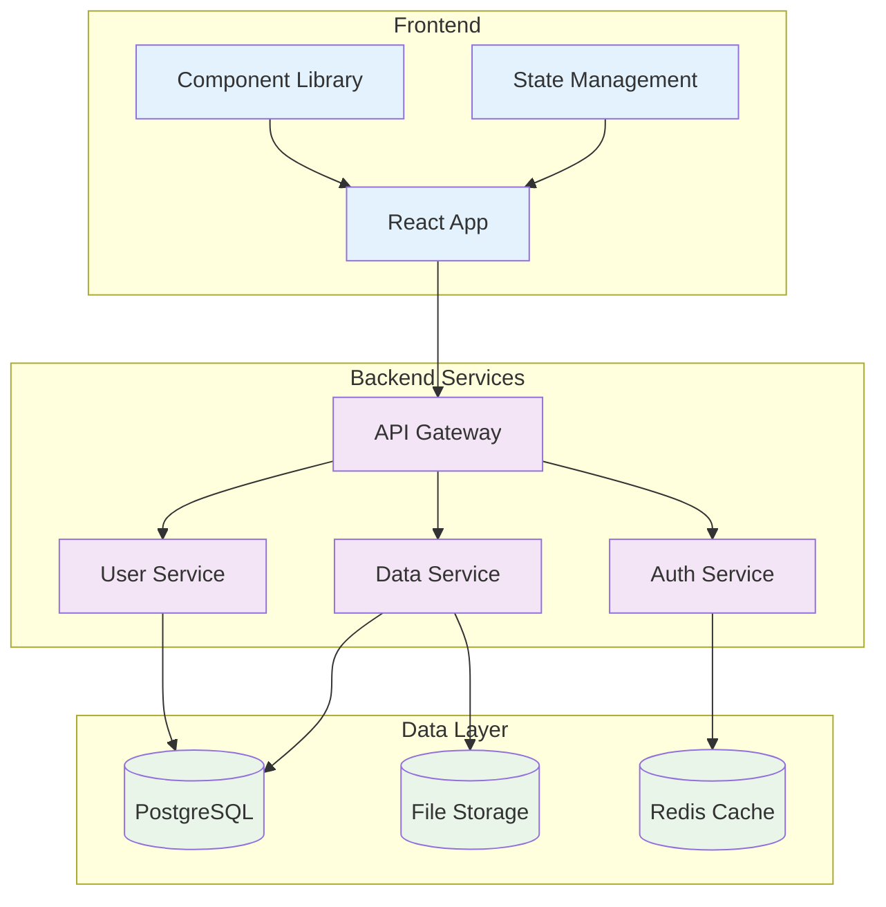

# Sample Markdown Document 2

This document demonstrates advanced Mermaid diagrams and real-world scenarios.

## CI/CD Pipeline

## Project Timeline

## Class Hierarchy

## System Architecture

This document demonstrates **4 advanced mermaid diagrams** including Gantt charts, class diagrams, and styled flowcharts.
