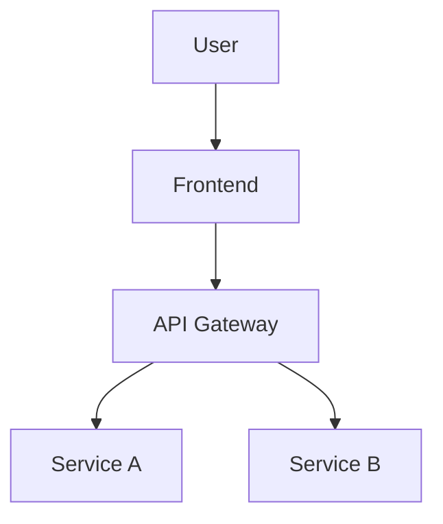
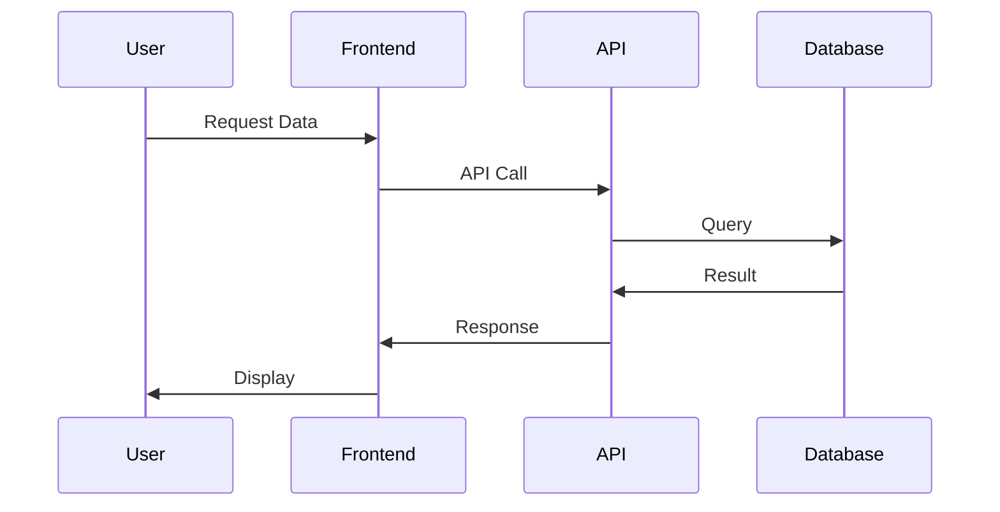

# Mermaid Slides VS Code Extension

Transform your markdown mermaid diagrams into beautiful presentation slides directly within VS Code.

## Features

- **Preview Mermaid Slides**: Right-click on any markdown file and select "Preview Mermaid Slides" to transform your mermaid diagrams into presentation slides
- **Auto-detection**: Automatically detects mermaid diagrams in markdown files
- **Multiple Themes**: Support for light, dark, and various themed presentations
- **Easy Navigation**: Navigate through your slides with keyboard shortcuts and mouse controls
- **Integrated Workflow**: Seamlessly integrates with your existing VS Code markdown editing workflow

## Usage

1. Open a markdown file containing mermaid diagrams
2. Right-click in the editor and select "Preview Mermaid Slides"
3. Or use the command palette (Ctrl+Shift+P / Cmd+Shift+P) and search for "Preview Mermaid Slides"
4. Your slides will open in a new panel beside your editor

## Requirements

- VS Code version 1.60.0 or higher
- Markdown files with mermaid code blocks

## Extension Settings

This extension contributes the following settings:

- `mermaidSlides.theme`: Default theme for presentations (light, dark, neutral, base, forest, default)
- `mermaidSlides.autoDetect`: Automatically detect mermaid diagrams in markdown files
- `mermaidSlides.showPreviewButton`: Show preview button in editor title bar

## Example

Create a markdown file with mermaid diagrams:

```markdown
# My Presentation

## Slide 1: System Overview



## Slide 2: Data Flow


```

Then right-click and select "Preview Mermaid Slides" to see your presentation!

## Known Issues

- This is the initial version of the extension
- The React app embedding is currently a placeholder and will be fully implemented in future versions

## Release Notes

### 1.0.0

- Initial release of Mermaid Slides extension
- Basic webview integration
- Command palette and context menu support
- Configuration options for themes and auto-detection

---

## Development

This extension is part of the larger Mermaid Slides project which includes:
- Web deployment (https://kanad13.github.io/mermaid-slides/)
- Offline package distribution
- VS Code extension (this extension)

For more information, visit the [project repository](https://github.com/yourusername/mermaid-slides).