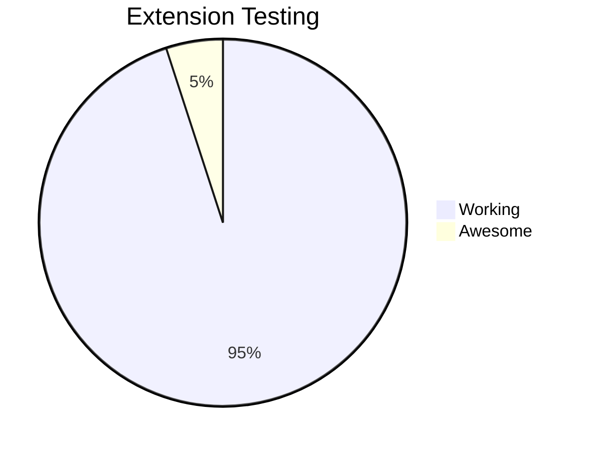

# My Mermaid Slides Test

Test the extension with this simple diagram:

## Another Test

## Another Test

## Another Test

## Another Test

## Another Test

## Another Test

## Another Test

## Another Test

## Another Test

## Another Test

## Another Test

## Another Test

## Another Test

# Images

