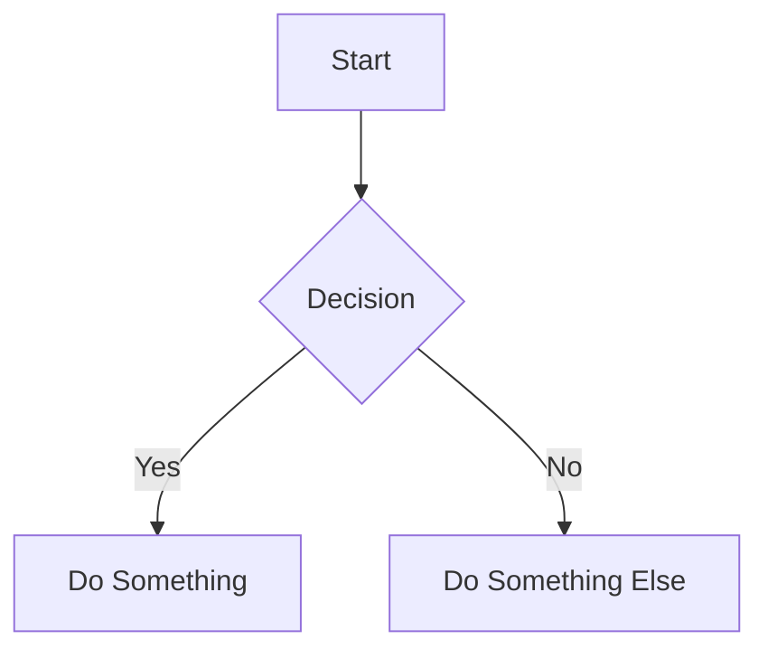
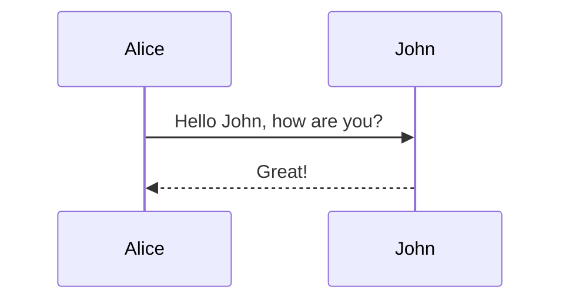

# 🧜‍♀️ Mermaid Slides - Offline Package

Transform your markdown files containing Mermaid diagrams into beautiful presentation slides, **completely offline**!

## ✨ Features

- 📤 **File Upload**: Upload markdown files with Mermaid diagrams
- 🎨 **Multiple Themes**: Light, dark, and various Mermaid themes
- 🖼️ **Presentation Mode**: Navigate slides with keyboard shortcuts
- 📱 **Responsive Design**: Works on desktop, tablet, and mobile
- 🌐 **Completely Offline**: No internet connection required
- 🔒 **Privacy-First**: All processing happens locally in your browser

## 🚀 Quick Start

### Option 1: Automatic Setup (Recommended)

**Windows:**
```bash
# Double-click or run in Command Prompt
start-server.bat
```

**macOS/Linux:**
```bash
# Double-click or run in Terminal
./start-server.sh
```

### Option 2: Manual Setup

**If you have Python 3 installed:**
```bash
python3 start-server.py
# or on Windows:
python start-server.py
```

**If you have Node.js installed:**
```bash
node start-server.js
```

### Option 3: Simple Python Server (Basic)

If you prefer the most basic setup:
```bash
# Python 3
python3 -m http.server 3000

# Python 2 (legacy)
python -m SimpleHTTPServer 3000
```

Then open your browser to: `http://localhost:3000`

## 📋 System Requirements

**Required** (at least one):
- **Python 3.x** - [Download here](https://python.org/downloads/)
- **Node.js** - [Download here](https://nodejs.org/download/)

**Supported Browsers:**
- Chrome 90+
- Firefox 90+
- Safari 14+
- Edge 90+

**Operating Systems:**
- ✅ Windows 10/11
- ✅ macOS 10.15+
- ✅ Linux (Ubuntu, CentOS, etc.)

## 📖 How to Use

1. **Start the server** using one of the methods above
2. **Open your browser** - it should open automatically at `http://localhost:3000`
3. **Upload a markdown file** containing Mermaid diagrams
4. **View as slides** and navigate with keyboard shortcuts

### 📄 Markdown Format

Your markdown files should contain Mermaid diagram code blocks:

````markdown
# My Presentation

## Slide 1: Flow Chart


## Slide 2: Sequence Diagram

````

### ⌨️ Keyboard Shortcuts

**In Presentation Mode:**
- `→` / `Space` - Next slide
- `←` - Previous slide
- `Escape` - Exit presentation
- `F` - Toggle fullscreen
- `G` - Toggle grid view
- `?` - Show help

## 🗂️ Package Contents

```
mermaid-slides-offline/
├── index.html              # Main application
├── assets/                 # Bundled CSS and JavaScript
│   ├── index-*.css         # Styles (Tailwind CSS)
│   ├── index-*.js          # Main application code
│   └── *.js                # Mermaid diagram modules
├── examples/               # Sample assets
│   └── assets/            # Example images
├── start-server.py         # Python server script
├── start-server.js         # Node.js server script
├── start-server.sh         # Unix/Linux launcher
├── start-server.bat        # Windows launcher
└── README.md              # This file
```

## 🔧 Troubleshooting

### Server Won't Start

**Error: "Port 3000 is in use"**
- The scripts will automatically find another available port
- Or manually specify a different port: `python3 start-server.py --port 3001`

**Error: "Python/Node.js not found"**
- Install Python 3: https://python.org/downloads/
- Or install Node.js: https://nodejs.org/download/
- Restart your terminal/command prompt after installation

### Browser Issues

**Blank page or errors:**
- Make sure you're accessing `http://localhost:PORT` (not `file://`)
- Try refreshing the page
- Check the browser console for errors (F12)

**File upload not working:**
- Ensure your markdown file contains Mermaid code blocks
- Try the "Load Sample" button first to test functionality
- Check file size (recommended: < 10MB)

### Network Security

**Corporate/School Networks:**
- The application runs entirely on your local machine
- No external network access required
- Some networks may block local servers - try different ports

## 🆚 Comparison with Online Version

| Feature | Offline Package | Online Version |
|---------|----------------|----------------|
| Internet Required | ❌ None | ✅ Required |
| File Privacy | 🔒 100% Local | 🔒 Client-side only |
| Setup | 📦 One-time | 🌐 Instant |
| Updates | 📥 Manual download | 🔄 Automatic |
| Performance | ⚡ Fast (local) | 🌐 Network dependent |

## 📞 Support & Updates

- **Issues**: Report problems or request features at the GitHub repository
- **Updates**: Download the latest offline package from GitHub releases
- **Documentation**: Full documentation available in the online version

## 📄 License

MIT License - Feel free to use, modify, and distribute.

---

**Version**: 1.0.0 (Offline Package)  
**Last Updated**: 2025-07-03  
**Compatibility**: All major browsers and operating systems

🎉 **Happy presenting!** Transform your Mermaid diagrams into beautiful slides, completely offline.