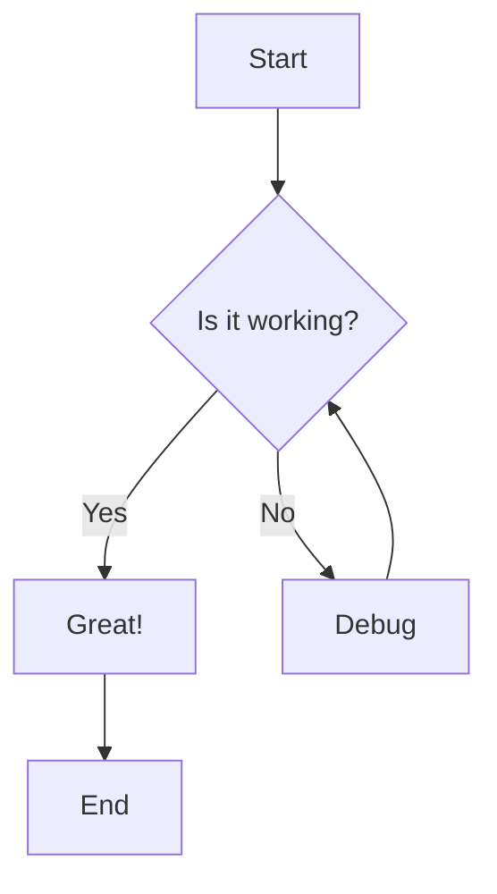
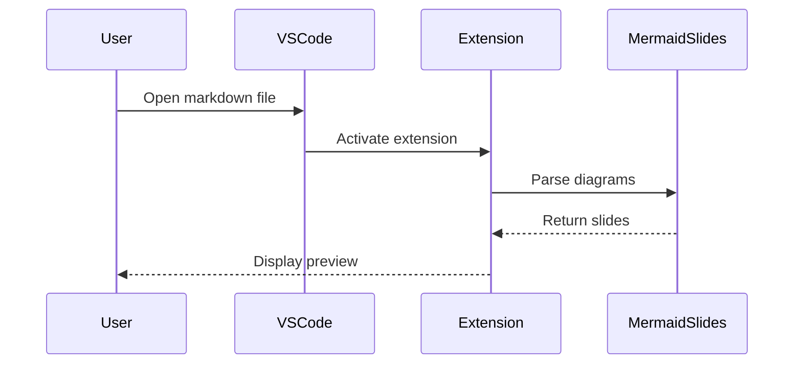

# Mermaid Slides Extension Demo

This is a test file to demonstrate the VS Code extension functionality.

## Sample Mermaid Diagram

## Another Diagram

## Test Instructions

1. Open this file in VS Code with the extension installed
2. Look for the "Preview Mermaid Slides" button in the tab bar
3. Click it to open the preview
4. Navigate through the slides using arrow keys or navigation controls