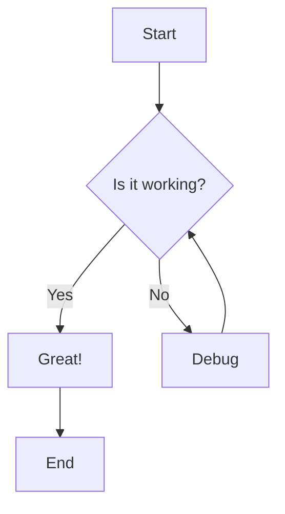
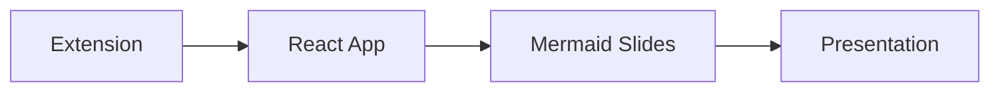

# Test Mermaid Slides Extension

This is a test markdown file to verify the VS Code extension works correctly.

## Sample Mermaid Diagram

## Another Diagram

## Test Complete

If you can see this content in the extension preview, the embedding is working correctly!