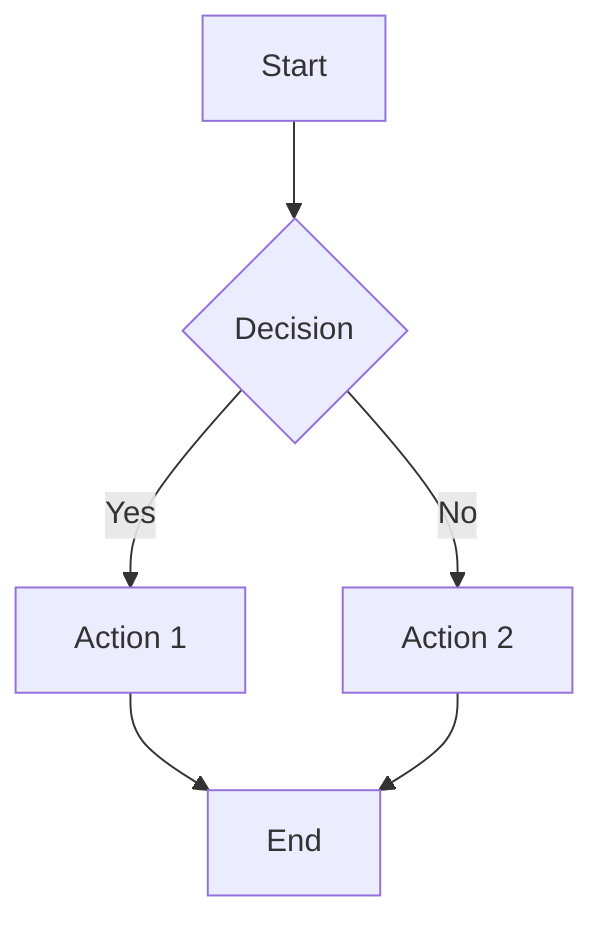
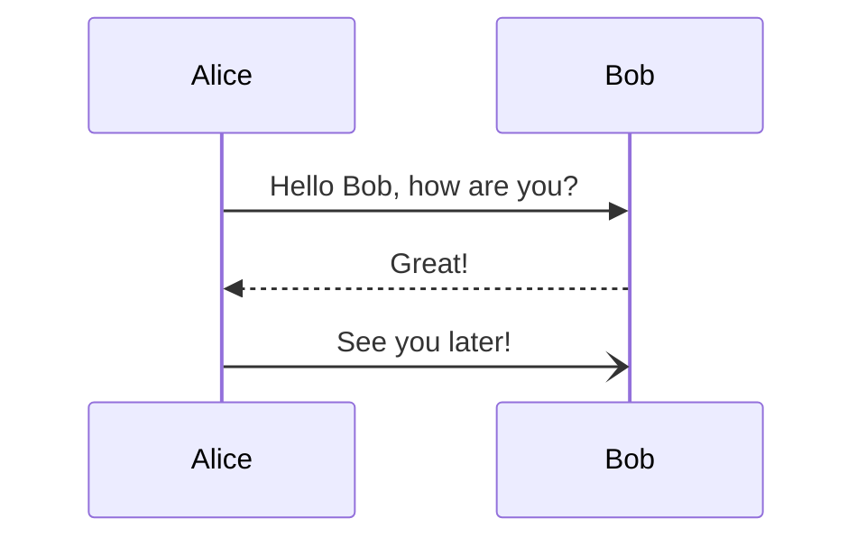

# Test Mermaid Slides

This is a test file for verifying the Settings panel functionality.

## Diagram 1: Simple Flowchart

## Diagram 2: Sequence Diagram

## Testing Instructions

1. Upload this file to Mermaid Slides
2. Click the **Settings gear icon** (should be where the theme dropdown was)
3. Test theme selection: Default → Dark → Forest → Base → Neutral
4. Try the auto-hide toggle (web only)
5. Click "About Mermaid Slides" to see GitHub link