# Flowchart diagram

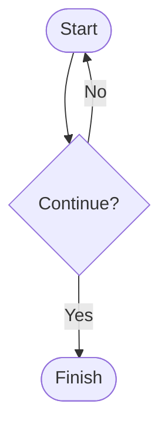

# Duplicate sequence one

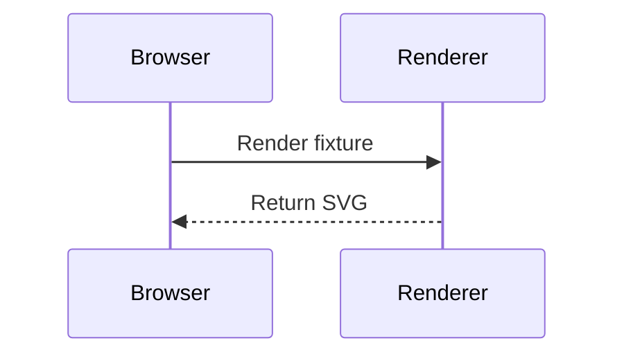

# Duplicate sequence two


# Entity relationship diagram

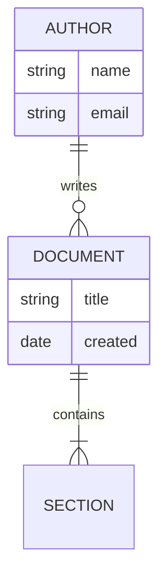

# Class diagram

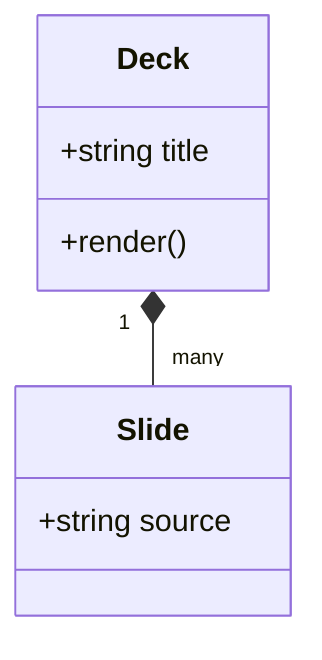

# State diagram

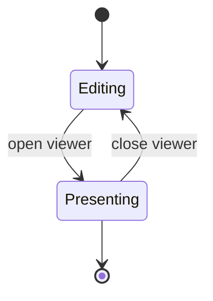

# Gantt diagram

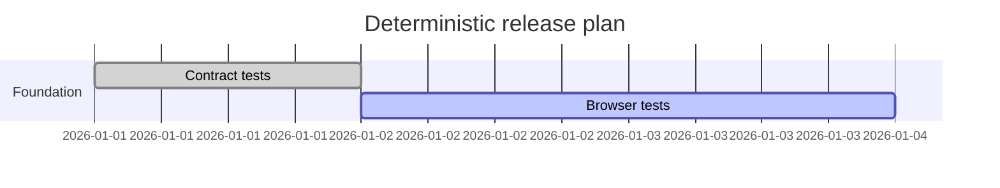

# Pie diagram

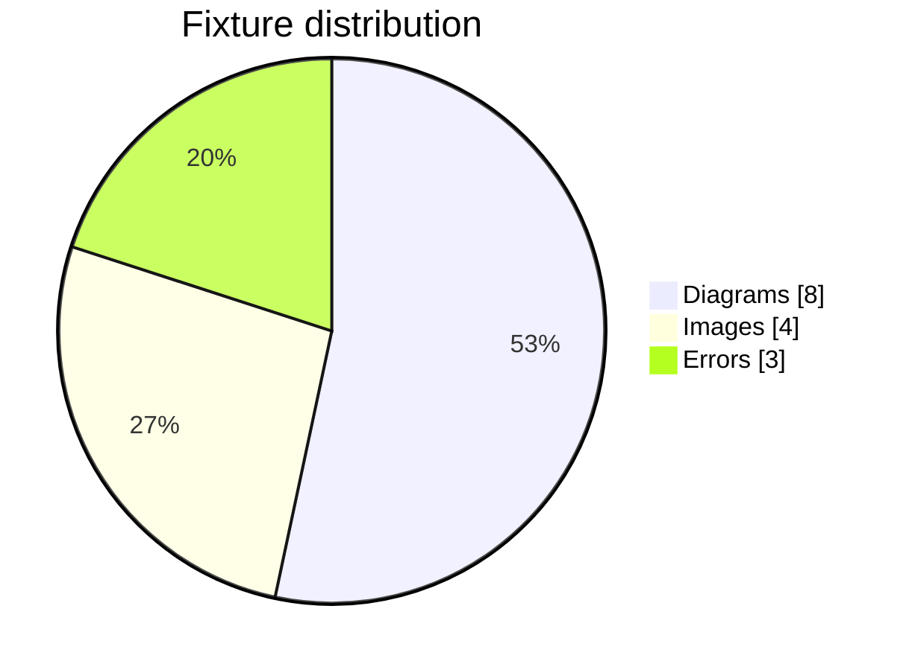

# Git graph diagram

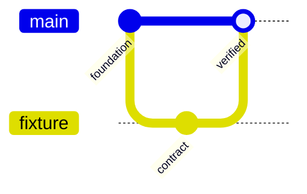

# Tiny diagram


# Tall diagram

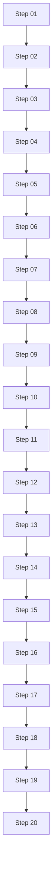

# Wide diagram

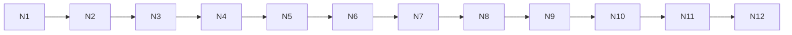

# Large diagram

```mermaid
flowchart TD
    L01[Large fixture node 01 with deterministic descriptive content] --> L02[Large fixture node 02 with deterministic descriptive content]
    L02 --> L03[Large fixture node 03 with deterministic descriptive content]
    L03 --> L04[Large fixture node 04 with deterministic descriptive content]
    L04 --> L05[Large fixture node 05 with deterministic descriptive content]
    L05 --> L06[Large fixture node 06 with deterministic descriptive content]
    L06 --> L07[Large fixture node 07 with deterministic descriptive content]
    L07 --> L08[Large fixture node 08 with deterministic descriptive content]
    L08 --> L09[Large fixture node 09 with deterministic descriptive content]
    L09 --> L10[Large fixture node 10 with deterministic descriptive content]
    L10 --> L11[Large fixture node 11 with deterministic descriptive content]
    L11 --> L12[Large fixture node 12 with deterministic descriptive content]
    L12 --> L13[Large fixture node 13 with deterministic descriptive content]
    L13 --> L14[Large fixture node 14 with deterministic descriptive content]
    L14 --> L15[Large fixture node 15 with deterministic descriptive content]
    L15 --> L16[Large fixture node 16 with deterministic descriptive content]
    L16 --> L17[Large fixture node 17 with deterministic descriptive content]
    L17 --> L18[Large fixture node 18 with deterministic descriptive content]
    L18 --> L19[Large fixture node 19 with deterministic descriptive content]
    L19 --> L20[Large fixture node 20 with deterministic descriptive content]
    L20 --> L21[Large fixture node 21 with deterministic descriptive content]
    L21 --> L22[Large fixture node 22 with deterministic descriptive content]
    L22 --> L23[Large fixture node 23 with deterministic descriptive content]
    L23 --> L24[Large fixture node 24 with deterministic descriptive content]
    L24 --> L25[Large fixture node 25 with deterministic descriptive content]
    L25 --> L26[Large fixture node 26 with deterministic descriptive content]
    L26 --> L27[Large fixture node 27 with deterministic descriptive content]
    L27 --> L28[Large fixture node 28 with deterministic descriptive content]
    L28 --> L29[Large fixture node 29 with deterministic descriptive content]
    L29 --> L30[Large fixture node 30 with deterministic descriptive content]
    L30 --> L31[Large fixture node 31 with deterministic descriptive content]
    L31 --> L32[Large fixture node 32 with deterministic descriptive content]
    L32 --> L33[Large fixture node 33 with deterministic descriptive content]
    L33 --> L34[Large fixture node 34 with deterministic descriptive content]
    L34 --> L35[Large fixture node 35 with deterministic descriptive content]
    L35 --> L36[Large fixture node 36 with deterministic descriptive content]
```

# Empty Mermaid input

```mermaid
```

# Malformed Mermaid input

```mermaid
flowchart TD
    A -- definitely not valid -->
```

# Normal local image


# Already-cached local image


# Delayed local image


# Broken local image


# Long title fixture with enough deterministic text to exercise wrapping, clipping, navigation labels, grid cards, and later printable headings without relying on generated prose or runtime randomness in any distribution channel

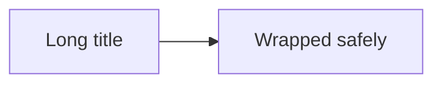

# Long Mermaid error source

```mermaid
flowchart TD
    E01[Long malformed fixture segment 01] --> E02[Long malformed fixture segment 02]
    E02 --> E03[Long malformed fixture segment 03]
    E03 --> E04[Long malformed fixture segment 04]
    E04 --> E05[Long malformed fixture segment 05]
    E05 --> E06[Long malformed fixture segment 06]
    E06 --> E07[Long malformed fixture segment 07]
    E07 --> E08[Long malformed fixture segment 08]
    E08 --> E09[Long malformed fixture segment 09]
    E09 --> E10[Long malformed fixture segment 10]
    E10 --> E11[Long malformed fixture segment 11]
    E11 --> E12[Long malformed fixture segment 12]
    E12 --> E13[Long malformed fixture segment 13]
    E13 --> E14[Long malformed fixture segment 14]
    E14 --> E15[Long malformed fixture segment 15]
    E15 --> E16[Long malformed fixture segment 16]
    BROKEN_END -->
```

# Hostile title <script data-fixture="title">window.fixtureAttack=true</script>

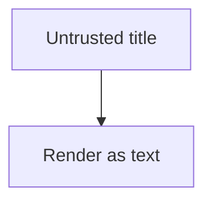

# Hostile image alt text


